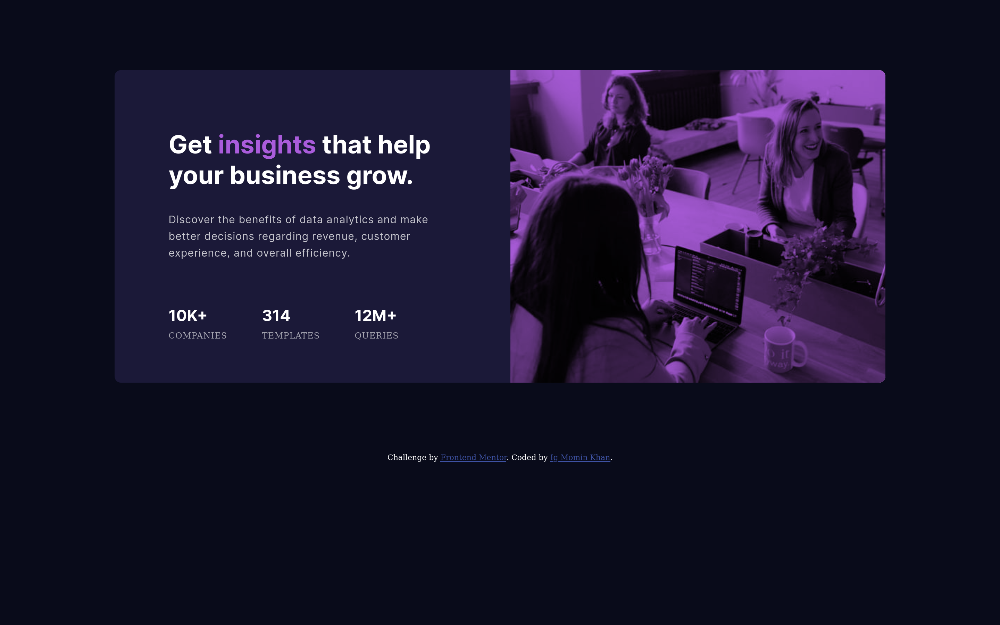

# Frontend Mentor - Stats preview card component solution

This is a solution to the [Stats preview card component challenge on Frontend Mentor](https://www.frontendmentor.io/challenges/stats-preview-card-component-8JqbgoU62). Frontend Mentor challenges help you improve your coding skills by building realistic projects.

## Table of contents

- [Overview](#overview)
  - [The challenge](#the-challenge)
  - [Screenshot](#screenshot)
  - [Links](#links)
- [My process](#my-process)
  - [Built with](#built-with)
  - [What I learned](#what-i-learned)
  - [Continued development](#continued-development)
  - [Useful resources](#useful-resources)
- [Author](#author)
- [Acknowledgments](#acknowledgments)

## Overview

### The challenge

Users should be able to:

- View the optimal layout depending on their device's screen size

### Screenshot

### Links

- Solution URL: [Add solution URL here]( )
- Live Site URL: [Add live site URL here]( )

## My process

### Built with

- Semantic HTML5 markup
- CSS custom properties
- Flex-box
- Mobile-first workflow

### What I learned

Throughout this project, I have learned the CSS property `Background-blend-mode`, And two HTML attributes `Src-set and sizes`. I have also learned how to make responsive designs with CSS flexbox.

### Continued development

This project does not have cross-browser support. I will add this feature later.

### Useful resources

- [Example resource 1](https://developer.mozilla.org/en-US/docs/Web/CSS/background-blend-mode) - This helped me to learn background-blend mode. I really liked this CSS property and will use it going forward.
 

## Author

- Github - [@IgMominKhan](https://github.com/IgMominKhan)
- Frontend Mentor - [@IgMominKhan](https://www.frontendmentor.io/profile/IgMominKhan)
- Twitter - [@IgMominKhan](https://twitter.com/Ig_Momin_Khan)
- Facebook - [@IgMominKhan](https://www.facebook.com/profile.php?id=100028163183392)

## Acknowledgments

W3schools, MDN and Other resources has helped me well. Basically without internet connection it's almost impossible for me to build this project. Thanks to all.
